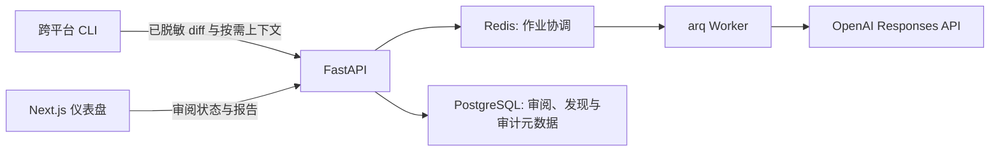

# 架构

## 目标与边界

Review Agent v1 审阅本地 Python Git 变更，聚焦可证实的正确性、安全性和直接回归问题。审阅结论是建议性的：系统不创建提交、不修改被审阅仓库、不评论 Pull Request，也不改变 CI 或合并状态。

## 组件

`apps/cli` 在本地读取 Git diff，应用 `.review-agentignore`，对常见密钥脱敏，并只接受调用者以 `--context` 明确指定的文件。`apps/api` 使用 FastAPI/Pydantic 暴露 OpenAPI 契约；`apps/web` 从该契约生成 TypeScript 类型。当前骨架返回确定性的中文占位报告，尚未接入队列、数据库或模型调用。

生产实现中，API 将组织标识作为每次读写的必需范围；PostgreSQL 保存审阅、发现和审计元数据，Redis 仅保存任务协调状态。原始按需上下文最多保留 30 天，并与结论和审计数据分开管理。任何日志不得包含 diff、源码、提示词或凭据。

## 本地运行

1. 使用 `docker compose -f infra/docker-compose.yml up -d` 启动依赖服务。
2. 在 `apps/api` 执行 `uv run uvicorn review_agent_api.main:app --app-dir src --reload`。
3. 在仓库根目录执行 `npm install` 后运行 `npm --workspace @review-agent/web run dev`。
4. 运行 `uv run --directory apps/cli review-agent review --diff-file change.diff` 提交本地 diff。
