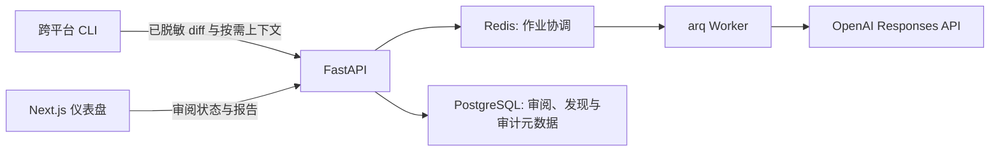

# 架构

## 目标与边界

Review Agent v1 审阅本地 Python Git 变更，聚焦可证实的正确性、安全性和直接回归问题。审阅结论是建议性的：系统不创建提交、不修改被审阅仓库、不评论 Pull Request，也不改变 CI 或合并状态。

## 组件

`apps/cli` 在本地读取 Git diff，应用 `.review-agentignore`，对常见密钥脱敏，并只接受调用者以 `--context` 明确指定的文件。它以 CLI PAT 认证，不再提交可伪造的组织标识。`apps/api` 使用 FastAPI/Pydantic 暴露 OpenAPI 契约；`apps/web` 从该契约生成 TypeScript 类型。

API 的组织、用户、成员关系、邀请码、邮箱登录令牌、会话、PAT、审查任务、按需上下文和审查规则均存储在 PostgreSQL。请求身份决定 `organization_id`，每个组织资源的读取、更新与删除查询都同时按资源 ID 和组织 ID 过滤。邀请码、邮箱登录令牌、会话令牌和 PAT 仅持久化 SHA-256 哈希；PAT 和会话明文仅在创建响应中出现。原始 diff 与上下文都有 30 天到期时间。

本地开发时，Mailpit 接收 SMTP 登录邮件，开发者通过其 Web 收件箱获取链接；明文令牌不会写入应用日志或数据库。API 将审查 ID 投递至 Redis，arq worker 加载同一组织的任务、规则和获准上下文。worker 在请求 OpenAI Responses API 前再次脱敏，使用 `store=false`，并以 Pydantic JSON Schema 校验输出。只有路径、起止行均对应 diff 新增行的发现会被保存；无法确认时，worker 返回有限的上下文路径请求。

登录请求显式指定组织 ID；服务仅为该组织成员生成令牌，并把组织 ID 放入链接及令牌记录。验证 API 同时匹配令牌、邮箱和组织 ID。Web 页面不会自动消耗链接，避免邮件扫描器导致令牌提前失效；用户确认后由 API 写入 HttpOnly Cookie，并清理地址栏令牌。CORS 只接受 `CORS_ORIGINS` 中列出的 Web 来源并允许这些来源携带 Cookie。

生产实现中，API 将组织标识作为每次读写的必需范围；PostgreSQL 保存审阅、发现和审计元数据，Redis 仅保存任务协调状态。原始按需上下文最多保留 30 天，并与结论和审计数据分开管理。任何日志不得包含 diff、源码、提示词或凭据。

## 本地运行

1. 使用 `docker compose -f infra/docker-compose.yml up -d` 启动依赖服务。
2. 在 `apps/api` 执行 `uv run uvicorn review_agent_api.main:app --app-dir src --reload`。
3. 在仓库根目录执行 `npm install` 后运行 `npm --workspace @review-agent/web run dev`。
4. 运行 `uv run --directory apps/cli review-agent review --diff-file change.diff` 提交本地 diff。
